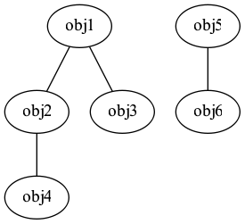

初探GC - 引用计数 VS 可达分析 | 深入探究JVM
============================
> sczyh30-浮生若梦，2015-06-29

主流的**垃圾回收**主要分两大类：**引用计数**和**可达性分析**。

## 1.引用计数法
引用计数的实现很简单，它的**思想**就是**给一个对象增加一个引用计数器，每当一个新的对象引用它时就给计数器加1，不引用了就减1，
当计数器为0时即可认为对象无用了，可进行回收。**

这个思想很简单，而且很多语言的底层(如Swift，Python)都是基于引用计数法进行回收的。
但是引用计数法有`一个很大的缺陷`：它`无法解决循环引用的问题`，
比如A引用B，B引用A，这样两对象的引用计数器永远不为0，两对象不能被回收，从而造成内存不能被及时清理。

JVM没有使用引用计数法，而是使用了可达性分析来进行GC。

题外话：C++ 11的智能指针就是基于引用计数的，它提供了`weak_ptr`来解决循环引用的问题。
(类似于Java中的`WeakReference`，作用类似)

## 2.可达性分析
**可达性分析**是基于*图论*的分析方法，它会**找一组对象作为*GC Root(根结点)*，并从根结点进行遍历，
遍历结束后如果发现某个对象是不可达的(即*从GC Root到此对象没有路径*)，那么它就会被标记为*不可达对象*，等待GC。**

比如，假设下图中obj1为GC Root，那么obj5和obj6就是不可达的：

## 3.哪些对象可以作为*GC Root*
能作为*GC Root的对象*必定为**可以存活的对象**，比如全局性的引用(**静态变量和常量**)
以及某些方法的**局部变量**(栈帧中的本地变量表)。

以下对象通常可以作为*GC Root*：
* **存活的线程**
* 虚拟机栈(栈桢中的本地变量表)中的引用的对象(**局部变量**)
* 方法区中的类静态属性以及常量引用的对象(**静态变量和常量**)
* 本地方法栈中JNI引用的局部变量以及全局变量

## 4.参考资料
* [GC roots](https://www.yourkit.com/docs/java/help/gc_roots.jsp)

[原文](https://www.sczyh30.com/posts/Java/jvm-gc-intro-count-vs-reachability/)

