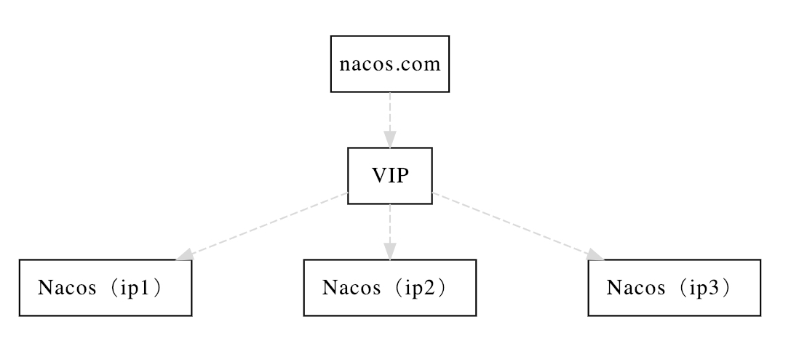
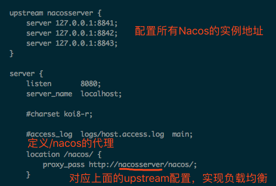

Spring Cloud Alibaba基础教程：Nacos的**集群部署**
===========================
> 翟永超，2019-02-21

继续说说`生产环境的Nacos搭建`，通过上一篇《Nacos的数据持久化》的介绍，
我们已经知道**Nacos对配置信息的存储原理**，在集群搭建的时候，必须要使用**集中化存储**，比如：MySQL存储。
下面顺着上一篇的内容，继续下去。通过本文，我们将完成`Nacos生产环境的搭建`。


## 1.集群搭建
根据官方文档的介绍，**Nacos的集群架构**大致如下图所示(省略了集中化存储信息的MySQL)：



下面我们就来一步步的介绍，我们每一步的搭建细节。

### 1.1.MySQL数据源配置
对于数据源的修改，在上一篇《Nacos的数据持久》中已经说明缘由，如果还不了解的话，可以先读一下这篇再回来看这里。

在进行集群配置之前，先完成对MySQL数据源的初始化和配置。主要分以下两步：
* **第一步**：初始化MySQL数据库，数据库初始化文件：`nacos-mysql.sql`，该文件可以在Nacos程序包下的`conf`目录下获得。
* **第二步**：修改`conf/application.properties`文件，增加支持MySQL数据源配置，添加(目前只支持mysql)数据源的url、用户名和密码。

> 更多的介绍与思考，可查看上一篇《Nacos的数据持久化》。

### 1.2.集群配置
在Nacos的`conf`目录下有一个`cluster.conf.example`，可以直接把`example`扩展名去掉来使用，
也可以单独创建一个`cluster.conf`文件，然后打开将后续要部署的`Nacos实例地址`配置在这里。

本文以在本地不同端口启动3个Nacos服务端为例，可以如下配置：
```
127.0.0.1:8841
127.0.0.1:8842
127.0.0.1:8843
```

> 注意：这里的例子仅用于本地学习测试使用，实际`生产环境必须部署在不同的节点上`，才能起到`高可用`的效果。
> 另外，Nacos的集群需要3个或3个以上的节点，并且确保这三个节点之间是可以互相访问的。

### 1.3.启动实例
在完成上面的配置之后，就可以开始在各个节点上启动Nacos实例，以组建Nacos集群来使用了。

由于本文中我们测试学习采用了本地启动多实例的情况，与真正生产部署会有一些差异，
所以下面分两种情况说一下，如何启动各个Nacos实例。

#### 本地测试
在集群配置的时候，我们设定了3个Nacos的实例都在本地，只是以不同的端口区分，所以我们在启动Nacos的时候，需要修改不同的端口号。

下面介绍一种方法来方便地启动Nacos的三个本地实例，我们可以将`bin`目录下的`startup.sh`脚本复制三份，
分别用来启动三个不同端口的Nacos实例，为了可以方便区分不同实例的启动脚本，可以把端口号加入到脚本的命名中。

这里我们通过`-Dserver.port`的方式，在启动命令中，为Nacos指定具体的端口号，以实现在本机上启动三个不同的Nacos实例来组成集群。

#### 生产环境
在实际生产环境部署的时候，由于每个实例分布在不同的节点上，我们可以直接使用默认的启动脚本(除非要调整一些JVM参数等才需要修改)。
只需要在各个节点的Nacos的`bin`目录下执行`sh startup.sh`命令即可。

### 1.4.Proxy配置
在Nacos的集群启动完毕之后，根据架构图所示，还需要提供`一个统一的入口`给我们用来维护以及给Spring Cloud应用访问。
简单地说，就是需要为上面启动的的三个Nacos实例做一个可以为它们`实现负载均衡的访问点`。
这个实现的方式非常多，这里就举个用Nginx来实现的简单例子吧。

在Nginx配置文件的http段中，我们可以加入下面的配置内容：



这样，当我们访问：`http://localhost:8080/nacos/`的时候，就会被*负载均衡*代理到之前我们启动的三个Nacos实例上了。
这里我们没有配置`upstream`的具体策略，默认会使用线性轮训的方式，如果有需要，也可以配置上更为复杂的分发策略。
这部分是Nginx的使用内容，这里就不作具体介绍了。

这里提一下我在尝试搭建时候碰到的一个问题，如果您也遇到了，希望下面的说明可以帮您解决问题。

错误信息如下：
```
2019-02-20 16:20:53,216 INFO The host [nacos_server] is not valid
 Note: further occurrences of request parsing errors will be logged at DEBUG level.

java.lang.IllegalArgumentException: The character [_] is never valid in a domain name.
	at org.apache.tomcat.util.http.parser.HttpParser$DomainParseState.next(HttpParser.java:926)
	at org.apache.tomcat.util.http.parser.HttpParser.readHostDomainName(HttpParser.java:822)
	at org.apache.tomcat.util.http.parser.Host.parse(Host.java:71)
	at org.apache.tomcat.util.http.parser.Host.parse(Host.java:45)
	at org.apache.coyote.AbstractProcessor.parseHost(AbstractProcessor.java:288)
	at org.apache.coyote.http11.Http11Processor.prepareRequest(Http11Processor.java:809)
	at org.apache.coyote.http11.Http11Processor.service(Http11Processor.java:384)
	at org.apache.coyote.AbstractProcessorLight.process(AbstractProcessorLight.java:66)
	at org.apache.coyote.AbstractProtocol$ConnectionHandler.process(AbstractProtocol.java:791)
	at org.apache.tomcat.util.net.NioEndpoint$SocketProcessor.doRun(NioEndpoint.java:1417)
	at org.apache.tomcat.util.net.SocketProcessorBase.run(SocketProcessorBase.java:49)
	at java.util.concurrent.ThreadPoolExecutor.runWorker(ThreadPoolExecutor.java:1149)
	at java.util.concurrent.ThreadPoolExecutor$Worker.run(ThreadPoolExecutor.java:624)
	at org.apache.tomcat.util.threads.TaskThread$WrappingRunnable.run(TaskThread.java:61)
	at java.lang.Thread.run(Thread.java:748)
```
主要原因是，一开始在配置`upstream`的时候，用了`nacos_server`作为名称，
而在Nacos使用的Tomcat版本中不支持`_`符号出现在域名位置，所以上面截图给出的`upstream`的名称是`nacos.server`，去掉了`_`符号。

到这里，Nacos的集群搭建就完成了！我们可以通过Nginx配置的代理地址：`http://localhost:8080/nacos/`来访问Nacos，
在Spring Cloud应用中也可以用这个地址来作为**注册中心和配置中心**的访问地址来配置。
读者可以使用文末的代码示例来修改原来的Nacos地址来启动，看是否可以获取配置信息来验证集群的搭建是否成功。
也可以故意的关闭某个实例，来验证Nacos集群是否还能正常服务。


## 2.深入思考
在Nacos官方文档的指引下，Nacos的集群搭建总体上还是非常顺畅的，没有什么太大的难度。
但是`值得思考的一个问题`跟在上一篇中讲数据持久化的思考类似，`作为一个注册中心和配置中心，Nacos的架构是否显得太过于臃肿？`
`除了Nacos自身之外，还需要依赖更多的中间件来完成整套生产环境的搭建`，相较于其他的可以用于服务发现与配置的中间件来说，就不那么有优势了。
**尤其对于*小团队*来说，`这样的复杂度与成本投入`，也是在选型的时候需要去考虑的。**


## 3.代码示例


[原文](http://blog.didispace.com/spring-cloud-alibaba-5/)

